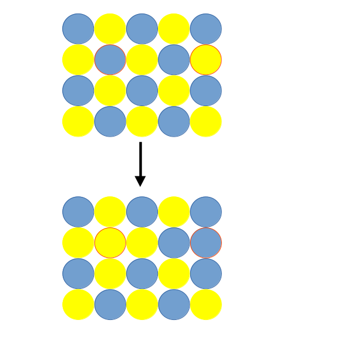

===============
1. Introduction
===============

Pymc-nmr has three modes of operation that are based on swap moves. A swap move is where the positions of two atoms, that are chosen at random, are interchanged.
For example, the two atoms outlined in red in the figure below.

The difference in energy of the old (*o*) and new (*n*) cells is calculated and employed within the Metropolis-Hastings sampling. Thus the move is accepted with
the probability

:math:`acc(o \rightarrow n) = min(1, exp(- \beta [E_{n} - E_{o}]))`

---------------
1.1 Monte Carlo
---------------

This is the standard Monte Carlo method described in the book by Frenkel and Smit and is very similar in style to DL_MONTE. Note as a *single* particle is moved
at a time it tends to be very slow and is only useful where the difference in energy is small. However, using the small MACE model the length of the simulations are more acceptable
and the method is capable of getting you out of a jam if the forces in your structure are very high.

-----------------
1.2 Basin Hopping
-----------------

The basin hopping approach is useful when the difference in energy between swapped particles is large. Each swap of particles is followed by an energy minimisation. The 
difference in energy is taken after the minimisation and the Metropolis selection rule applied. Although the calculation of the energy consumes more resources
the probability of the swap being accepted is significantly greater. 
In some cases the position of a particle is not known and we have created the possibility of using a NVT molecular dynamics calculation followed by energy minimisation
to further reduce the total energy of the cell.

----------------------------
1.2 Randomised Configuration
----------------------------

The last method is an ab initio random structure search method. In this approach all the particles of two specific type are swapped and an energy minimisation performed.
In out limited experience, this the basin hooping method is more efficient than this technique.

===============
2. Installation
===============

External libraries required are NUMPY, MACE and ASE (and their dependecies). In addition libraries to satisfy the ASE calculator 
or MLIP potentials may be necessary.

=========================
3. How to run the program
=========================

The program requires three input files, *control*, *potentials* and *basin.xyz* that contain the
keywords for the functionality of the program, potential model and the atomic
positions respectively (in extended xyz).

-----------
3.1 control
-----------

The input is broken into sections depending on the functionality. The
main input key words are

+--------------+-------------+------------------------------------------------------+
| **Key word** | **Type**    | **Functionality**                                    |
+==============+=============+======================================================+
| #            |             | comments the line (must be first char on the line)   |                                    
+--------------+-------------+------------------------------------------------------+
| print        | int         | The frequency of printing energies to mc.log         |
|              |             | defaults to 1 i.e. every iteration                   |
+--------------+-------------+------------------------------------------------------+
| check        | int         | The frequency at which a sanity check is undertaken  |
|              |             | defaults to 1000                                     |
+--------------+-------------+------------------------------------------------------+
| restart      |             | Restart the calculation with old configuration       |
|              |             | make sure to cp restart.xyz to basin.xyz             |
+--------------+-------------+------------------------------------------------------+
| temperature  | float       | The temperature (K) of simulation used in Boltzman   |
|              |             | sampling                                             |
+--------------+-------------+------------------------------------------------------+
| method       | string      | The type of simulation required. Use either          |
|              |             | basinhop (default), airss or monte. The latter       |
|              |             | is depricated at the moment as it does not appear    |
|              |             | to work for swapping Si/Al                           |
+--------------+-------------+------------------------------------------------------+
| close        |             | Finish all input                                     |
+--------------+-------------+------------------------------------------------------+
| archive      |             | Turns on the creation of a archive/history file      |
+--------------+-------------+------------------------------------------------------+
| archivefreq  | int         | The frequency at which the configuration is saved    |
|              |             | defaults to 1000                                     |
+--------------+-------------+------------------------------------------------------+
| equilsteps   | int         | The number of equilibration steps                    |
+--------------+-------------+------------------------------------------------------+
| savedownhill |             | During basin hopping method any configuration that   |
|              |             | has an energy lower than the previous configuration  |
|              |             | will be saved (NB there may have been an up hill move|
|              |             | between downhill events).                            |
+--------------+-------------+------------------------------------------------------+
| move         | string      | The move keyword is used to provide an action on the |
|              |             | configuration by the means of a second key word.     |
|              |             | Each keyword is described below                      |
+--------------+-------------+------------------------------------------------------+

Description of keywords to control the molecular dynamics functionality. 

+----------------+-------------+------------------------------------------------------+
| **Key word**   | **Type**    | **Functionality**                                    |
+================+=============+======================================================+
| mdtimestep     | float       | The time step in femtoseconds (default 2.0)          |
+----------------+-------------+------------------------------------------------------+
| mdtemperature  | float       | The temperature for the MD in K (default 1000 K)     |
+----------------+-------------+------------------------------------------------------+
| mdfirction     | float       | NVT friction (default 0.01 / fs)                     |
+----------------+-------------+------------------------------------------------------+
| mdsteps        | int         | The number of MD steps (default 1000)                |
+----------------+-------------+------------------------------------------------------+

Description of keywords to control the relaxation in basin hopping or AIRSS style calculations. 

+----------------+-------------+------------------------------------------------------+
| **Key word**   | **Type**    | **Functionality**                                    |
+================+=============+======================================================+
| relmethod      | string      | the type of relaxation method. Options are lbfgs     |
|                |             | (default), bfgs, or fire                             |
+----------------+-------------+------------------------------------------------------+
| reltol         | float       | tolerence for convergence                            |
+----------------+-------------+------------------------------------------------------+
| relsteps       | int         | The number of relaxation steps (default 1000)        |
+----------------+-------------+------------------------------------------------------+

The keywords that are specific to MC simulations only:

+----------------+-------------+------------------------------------------------------+
| **Key word**   | **Type**    | **Functionality**                                    |
+================+=============+======================================================+
| maxdistance    | float       | the maximum atomic displacement. The default is      |
|                |             | 0.001                                                |
+----------------+-------------+------------------------------------------------------+
| distanceupdate | int         | The number of MC steps between the updates of the    |
|                |             | max displacement to acieve the target ratio below    |
+----------------+-------------+------------------------------------------------------+
| distanceratio  | float       | The target ratio for the acceptance / rejection of   |
|                |             | particle displacements                               |
+----------------+-------------+------------------------------------------------------+
| maxvolume      | float       | the maximumvolume displacement. The default is       |
|                |             | 0.001                                                |
+----------------+-------------+------------------------------------------------------+
| volupdate      | int         | The number of MC steps between the updates of the    |
|                |             | max volume displacement to acieve the target ratio   |
|                |             | below                                                |
+----------------+-------------+------------------------------------------------------+
| volratio       | float       | The target ratio for the acceptance / rejection of   |
|                |             | volume expansion / contraction                       |
+----------------+-------------+------------------------------------------------------+

These keywords follow the *move* command in the control file.
+----------------+--------------------------------------------------------------------+
| **Key word**   |  **Functionality**                                                 |
+================+====================================================================+
| atoms          | The *atoms* keyword must be followed the number of atom types to   |
|                | be moved and the probability of the move occuring. It is only      |
|                | active in Monte Carlo simulations. An example is                   |
+----------------+--------------------------------------------------------------------+
| swap           | Swaps interchange the positions of two types. The number of atom   |
|                | pairs and the probability of the move occuring. It is only         |
|                | active in all types of calculation.                                |
+----------------+--------------------------------------------------------------------+
| moldyn         | This activates an NVT molecular dynamics calculation (only within  |
|                | basin hopping). An integer gives the probability of this ooccuring.|
+----------------+--------------------------------------------------------------------+
| volume         | A volume move within the monte Carlo method only An integer gives  | 
|                | the probability of this ooccuring.                                 | 
+----------------+--------------------------------------------------------------------+

An example ov *move atom* ::

   move atoms 2 100                                                  
   Si                                                                 
   O        
   
An example of *swap* ::
   move swap 2 100                                                    
   Si  Al                                                             
   K   ghost   (the fictitious particle must be called ghost) 

How to use molecular dynamics in basin hopping::
   move moldyn 20

Using the volume move in Monte Carlo::
   move volume 20

---------
3.2 basis
---------

The basis format follows that of a simplified extended xyz. The minimum format is::

   number_of_atoms
   Lattice="vectors * 9"
   name      x  y  z
   name      x  y  z

*NB* any fictitious or ghost atoms must be placed last in the basin.xyz file.

For example::

   2549
   Lattice="32.7232154959 0.0 0.0 0.0 32.7232154959 0.0 0.0 0.0 32.7232154959"
   O 1.4168603868  1.3899782202  1.3108695097
   O 4.1014301991  4.0478192159  1.4171530724
   O 3.7163970637  -1.3764087458  4.0580241564

--------------
3.3 potentials
--------------

Description of keywords used within the potentials file. This is consumed by the field.py 
class and controls the calculation style. 

+----------------+-------------+------------------------------------------------------+
| **Key word**   | **Type**    | **Functionality**                                    |
+================+=============+======================================================+
| species        | int         | the number of different types. Each species are on   |
|                |             | following lines e.g.                                 |
|                |             | species 1                                            |
|                |             | O 16.0 0.0 8.0 (the floats are required but not used |
|                |             | at present)                                          |
+----------------+-------------+------------------------------------------------------+
| close          |             | Finish all input                                     |
+----------------+-------------+------------------------------------------------------+
| #              |             | comments the line (must be first char on the line)   |                                    
+----------------+-------------+------------------------------------------------------+
| device         | string      | where the energy evaluation should be evaluated      |
|                |             | it is not checked by the program but sent directly   |
|                |             | the ASE/janus calculator. (default: "cuda")          |
+----------------+-------------+------------------------------------------------------+
| precision      | string      | The precision of the calculation.                    |
|                |             | It is not checked by the program but sent directly   |
|                |             | the ASE/janus calculator. (default: "float64")       |
+----------------+-------------+------------------------------------------------------+
| arch           | string      | The style of calculation used in the calculator.     |
|                |             | In theory any ASE calculator could be used but it    |
|                |             | could require the Field.py to be modified. Therefore |
|                |             | it is not checked by the program but sent directly   |
|                |             | the ASE/janus calculator. (default: "mace_mp")       |
+----------------+-------------+------------------------------------------------------+
| model          | string      | The full path to the MLIP model is required          |
+----------------+-------------+------------------------------------------------------+

=============
6. References
=============

